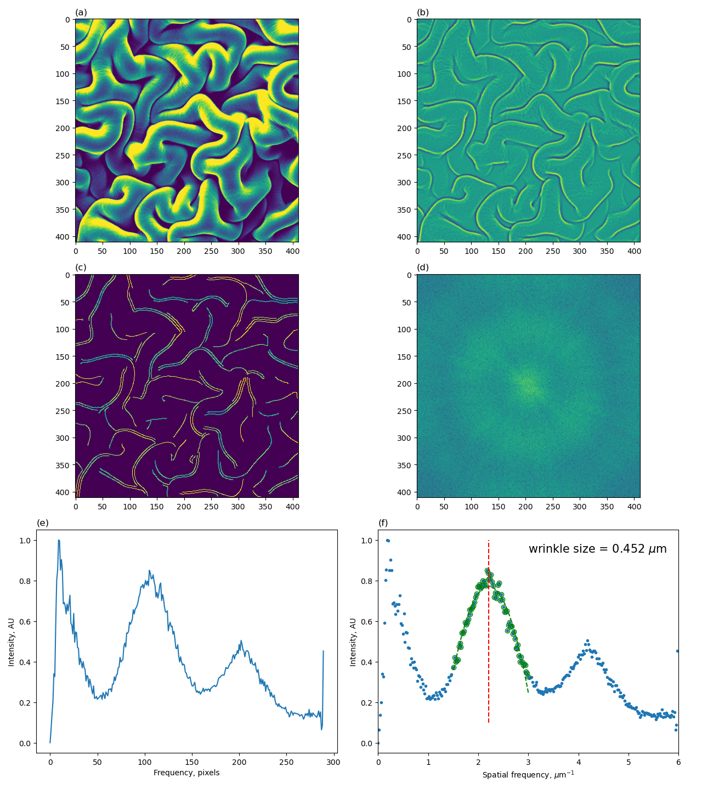
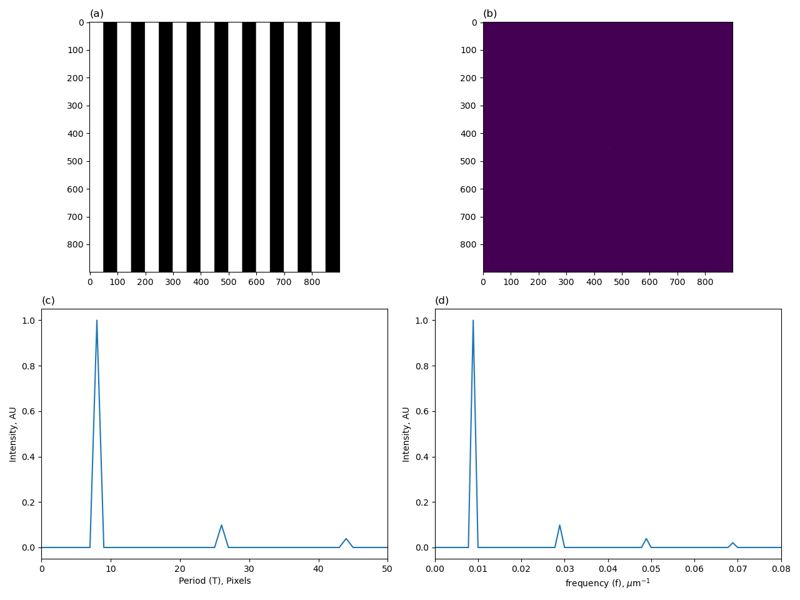
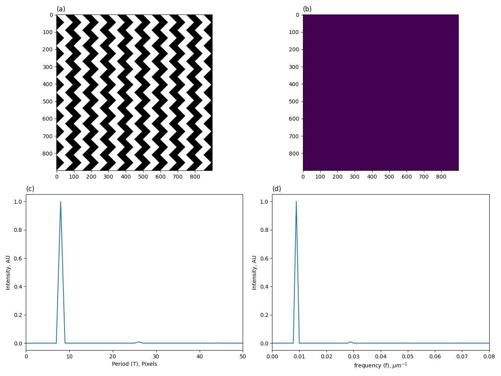
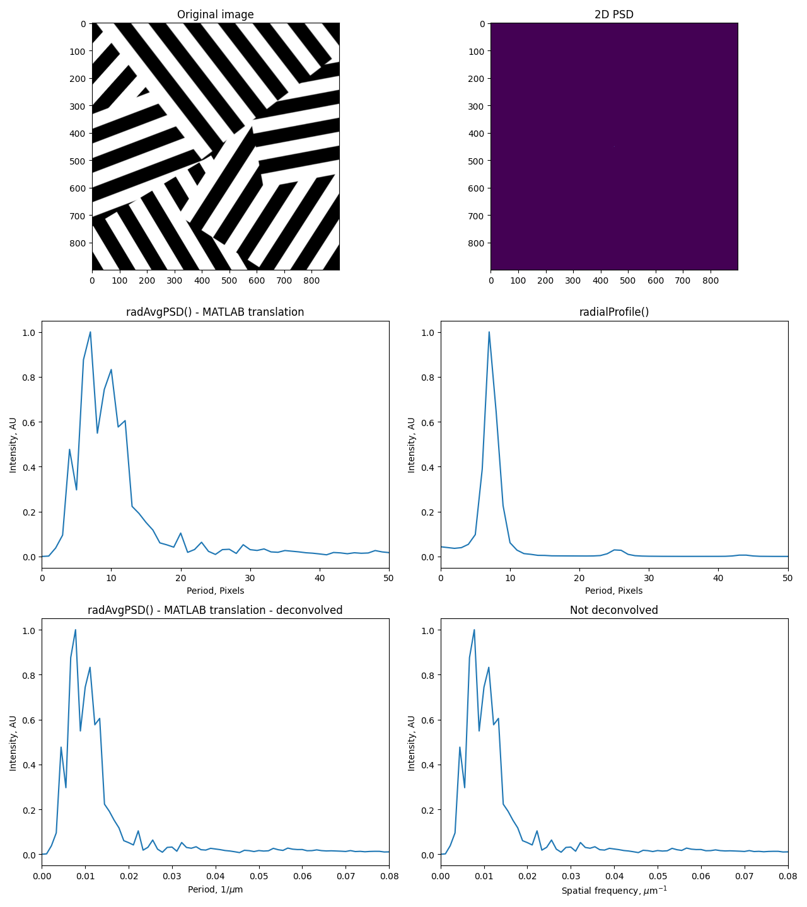
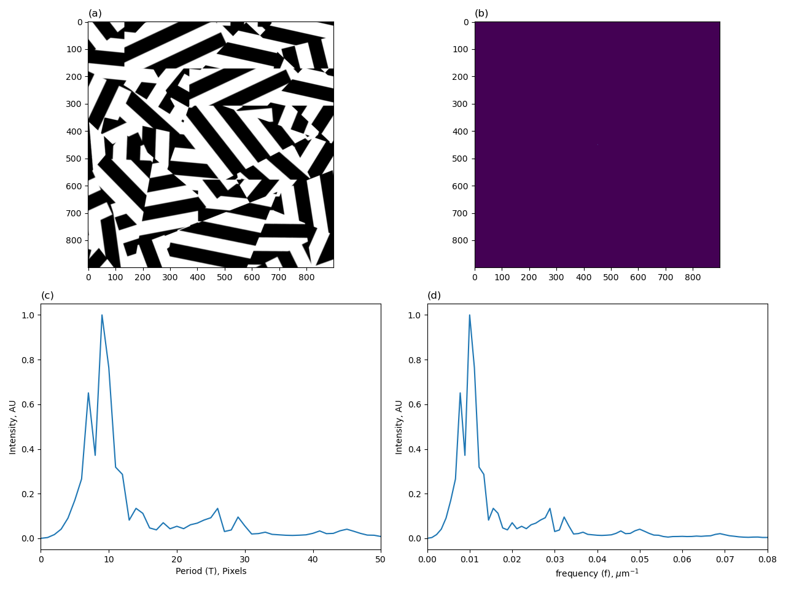

# wrinkleAnalysis
Fast Fourier Transform analysis for nanowrinkled surface feature analysis

## Tests

### kdf_biaxial_20um

This test uses a biaxial wrinkled surface with a scale bar of 20 microns (um). The scale bar is 170 pixels in length. 

Source: https://pubs.acs.org/doi/full/10.1021/acsami.8b16232 
ACS Appl. Mater. Interfaces 2019, 11, 6, 6325–6335 
Figure 6F

### kdf_uniaxial_20um

This test uses a uniaxial wrinkled surface with a scale bar of 20 microns (um). The scale bar is 170 pixels in length. 

Source: https://pubs.acs.org/doi/full/10.1021/acsami.8b16232 
ACS Appl. Mater. Interfaces 2019, 11, 6, 6325–6335 
Figure 6J

### vertical_lines

This test reproduces the results from Stimpson et al., 2020 for the vertical lines in Figure 1A first panel. 

Source: https://chemrxiv.org/engage/chemrxiv/article-details/60c74e50f96a009895287acf 
Figure 1 

Vertical lines test results: 

### chevron

This test reproduces the results from Stimpson et al., 2020 for the chevron lines in Figure 1A second panel. 

Source: https://chemrxiv.org/engage/chemrxiv/article-details/60c74e50f96a009895287acf 
Figure 1 

Chevron test results: 

### jigsaw and fragmented_jigsaw

This test reproduces the results from Stimpson et al., 2020 for the jigsaw and fragmented_jigsaw lines in Figure 1A third and forth panels. 

Source: https://chemrxiv.org/engage/chemrxiv/article-details/60c74e50f96a009895287acf 
Figure 1 

The jigsaw and fragmented jigsaw images were made using Photopea at https://www.photopea.com/. The original vertical lines image was used to create these transformed images. 

Jigsaw test results: 

Fragmented jigsaw test results: 
