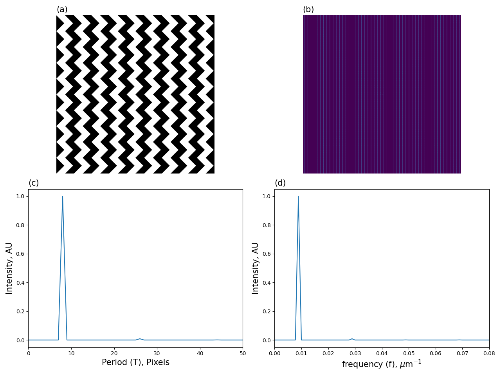
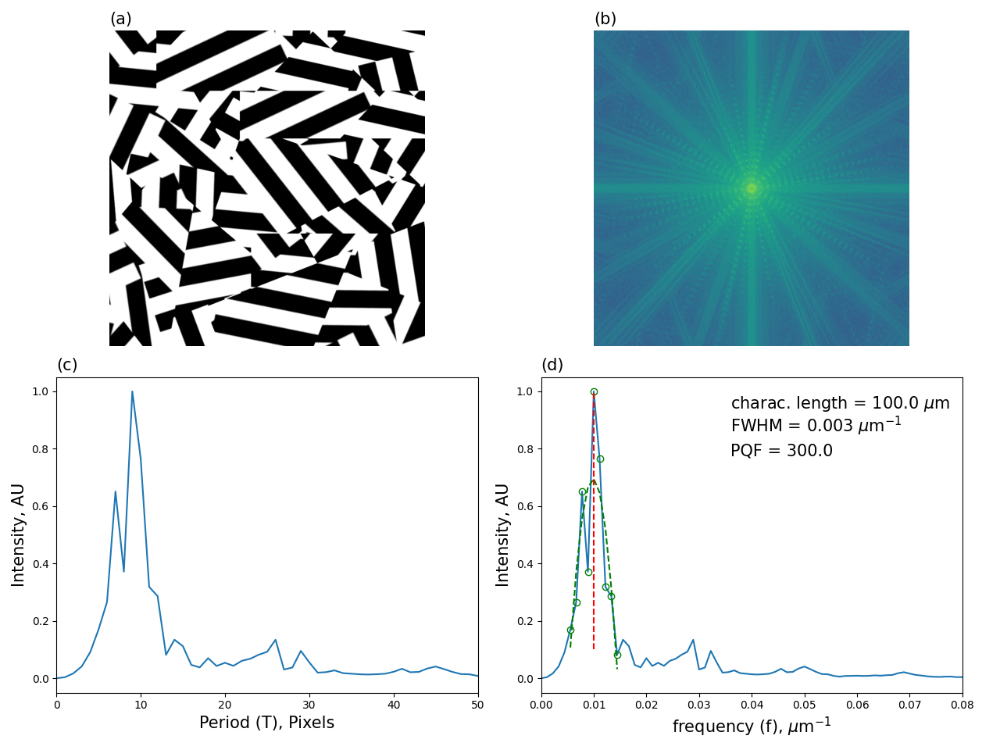
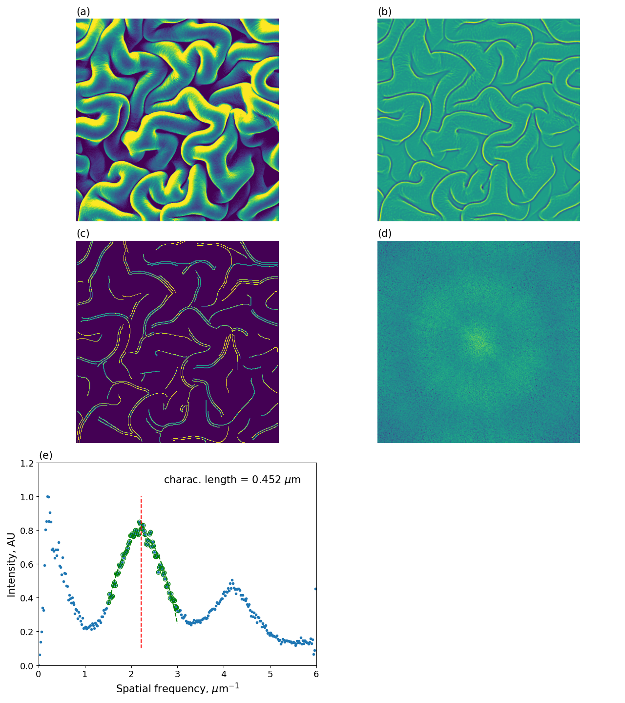
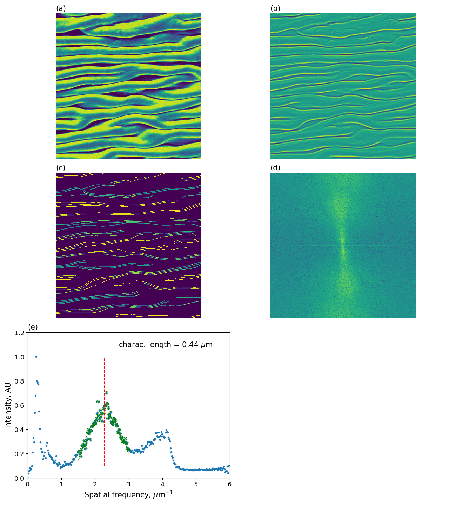
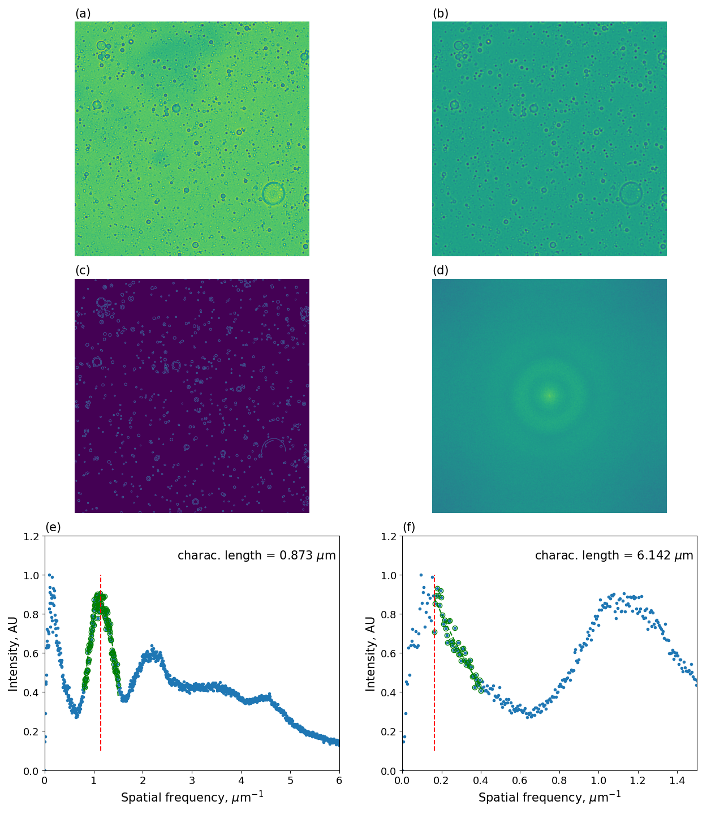
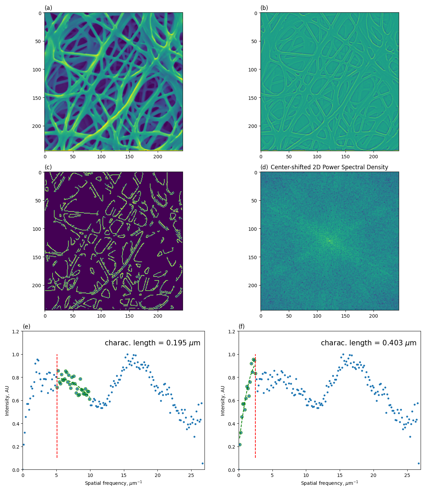

# morpholoPy
A suite of morphology analyses for the characterization of nanostructured surfaces.

<b>André Guerra</b> \
April, 2024 \
andre.guerra@mail.mcgill.ca  

---
<b>Description:</b> \
This repository contains Python implementations of image analysis algorithms for feature analysis of nanostructured material surfaces. Many of the scripts take an image file (e.g., `.png`, `.tif`) as input, conduct the periodic feature analyses and output figures summarizing the results. Many of the scripts currently require manual modification for defining your system. These are normally done in the "Manual input" section at the top of the script. The scripts will be updated in the future to be more robust and require less manual input at the code level.

---
## Core Contents
1. `test_cases/` $\rightarrow$ collection of test cases to validate and demonstrate usage of the analyses here.
2. `surfacetools/` $\rightarrow$ utilities dir that contains function definitions to be used by the scripts in this repo; contains a `__init__.py` file to enable package import behavior.
3. `characteristic_length.py` $\rightarrow$ main script executing the image for feature examinations and characteristic length determination. This script is used in all of the `experimental_surface_images/`.

## Tree Structure
<pre>
morpholoPy/
├── surfacetools/
│   ├── image_processing.py
│   ├── periodicfeatures.py
│   ├── roughness_params.py
│   └── surface_generators.py
├── test_cases/
│   ├── experimental_surface_images/
│   │   ├── cnc_emulsion_bubbles/
│   │   ├── cnc-poegma_biaxial_nanowrinkled/
│   │   ├── cnc-poegma_uniaxial_nanowrinkled/
│   │   ├── cnc-xg_biaxial_nanowrinkled/
│   │   ├── lysozyme_electrospun_afm/
│   │   └── lysozyme_electrospun_mats/
│   └── synthetic_images/
│       ├── chevron/
│       ├── tessellation/
│       ├── tessellation_fragmented/
│       └── vertical_lines/
└── README.md
</pre>

## References
1. Image Analysis of Structured Surfaces for Quantitative Topographical Characterization [(Stimpson et al., 2020)](https://doi.org/10.26434/chemrxiv.12736289.v1)
2. 2.5D Hierarchical Structuring of Nanocomposite Hydrogel Films Containing Cellulose Nanocrystals [(De France et al., 2019)](https://doi.org/10.1021/acsami.8b16232)
3. Pattern formation, structure and functionalities of wrinkled liquid crystal surfaces: A soft matter biomimicry platform [(Wang-Servio-Rey, 2023)](https://doi.org/10.3389/frsfm.2023.1123324)
4. Mechanogeometry of nanowrinkling in cholesteric liquid crystal surfaces [Wang-Servio-Rey, 2020](https://doi.org/10.1103/PhysRevE.101.062705)

---

## Validation by Synthetic Images

### Vertical stripes

This test reproduces the results from Stimpson et al., 2020 for the vertical stripes in Figure 1A first panel. 

Source: [Stimpson et al., 2020](https://chemrxiv.org/engage/chemrxiv/article-details/60c74e50f96a009895287acf) 
Figure 1 

#### Vertical stripes test results:

### Chevron

This test reproduces the results from Stimpson et al., 2020 for the chevron lines in Figure 1A second panel. 

Source: [Stimpson et al., 2020](https://chemrxiv.org/engage/chemrxiv/article-details/60c74e50f96a009895287acf) 
Figure 1 

##### Chevron test results:

### Vertical stripes tiled and fragmented tiles

This test reproduces the results from Stimpson et al., 2020 for the jigsaw and fragmented jigsaw lines in Figure 1A third and forth panels. 

Source: [Stimpson et al., 2020](https://chemrxiv.org/engage/chemrxiv/article-details/60c74e50f96a009895287acf) 
Figure 1 

The jigsaw and fragmented jigsaw images were made using Photopea at https://www.photopea.com/. The original vertical stripes image was used to create these transformed images. 

#### Vertical stripes tiled (tessellation) test results:

#### Fragmented tiles (tessellation fragmented) test results:

## Experimental Test Cases

### `cnc-poegma_biaxial_nanowrinkled/`

This test uses a biaxial wrinkled surface with a scale bar of 20 microns (um). The scale bar is 170 pixels in length. 
The image analysis parameters below were determined based on trial and error: 
|   Parameter     |    Value    |
|:----------------|:------------|
| dof_lo_sigma*   |  1.1        |
| dof_hi_sigma*   |  None       |
| canny_sigma*    |  1.4        |
| bar_len         |  20         |
| scale_bar**     |  170        |

*These parameters are fed as arguments to the python script `characteristic_length.py`. See DocString. 
**This parameter is determined by manual examination of the scale bar in the image usig ImageJ. In cases where the image was obtained from an SEM that uses the same banner convention as Queen's University Quanta 250, `measure_scale_bar` may be used to automatically obtain the scale bar size in pixels. 

Source: [De France et al., 2019](https://pubs.acs.org/doi/full/10.1021/acsami.8b16232) 
ACS Appl. Mater. Interfaces 2019, 11, 6, 6325–6335 
Figure 6F

#### Results summary figure

### `cnc-poegma_uniaxial_nanowrinkled/`

This test uses a uniaxial wrinkled surface with a scale bar of 20 microns (um). The scale bar is 170 pixels in length. 
The image analysis parameters below were determined based on trial and error: 
|   Parameter*    |    Value    |
|:----------------|:------------|
| dof_lo_sigma*   |  1.1        |
| dof_hi_sigma*   |  None       |
| canny_sigma*    |  1.4        |
| bar_len         |  20         |
| scale_bar**     |  170        |

*These parameters are fed as arguments to the python script `characteristic_length.py`. See DocString. 
**This parameter is determined by manual examination of the scale bar in the image usig ImageJ. In cases where the image was obtained from an SEM that uses the same banner convention as Queen's University Quanta 250, `measure_scale_bar` may be used to automatically obtain the scale bar size in pixels (see [xg-cnc_1-1](tests/xg-cnc_1-1/src/characteristic_length.py)).

Source: [De France et al., 2019](https://pubs.acs.org/doi/full/10.1021/acsami.8b16232) 
ACS Appl. Mater. Interfaces 2019, 11, 6, 6325–6335 
Figure 6J

#### Results summary figure

### `cnc-xg_biaxial_nanowrinkled/`

This test demonstrates the usage of the function `measureScaleBar()` with an SEM image that is not originally square and contains an info banner at the bottom with the length scale. 
The image analysis parameters below were determined based on trial and error: 
|   Parameter*   |    Value    |
|:---------------|:------------|
| dof_lo_sigma   |  1          |
| dof_hi_sigma   |  10         |
| canny_sigma    |  2          |

*These parameters are fed as arguments to the python script `characteristic_length.py`. See DocString.

#### Original SEM image

#### Results summary figure

### `cnc_emulsion_bubbles/`

The tests up to this point have examined images that exibit periodic features (e.g., synthetic patterns, or nanowrinkles). The characteristic length analysis performed can be extended to other images featuring periodic features. In this test, we analyzes an emulsion of CNC that contains dispersed bubbles of varying sizes. Here, we use `characteristic_length.py` to extract bubble characteristic length (diameter). 
The image analysis parameters below were determined based on trial and error: 
|   Parameter*   |    Value    |
|:---------------|:------------|
| dof_lo_sigma   |  3          |
| dof_hi_sigma   |  12         |
| canny_sigma    |  1.4        |

*These parameters are fed as arguments to the python script `characteristic_length.py`. See DocString.

---
#### Original image

#### Results summary figure

### `cnc-poegma_electrospun_mats/`

#### Original image poegma-cnc_0.2wtpct

#### Input parameters
The image analysis parameters below were determined based on guided trial and error. By visualizing the images, the user can modify the input parameters to improve the analysis results. 

*These parameters are fed as arguments to the python script `characteristic_length.py`. See DocString.

#### Results summary figure

---
#### Original image - poegma-cnc_0.2wtpct_swollen

#### Input parameters
The image analysis parameters below were determined based on guided trial and error. By visualizing the images, the user can modify the input parameters to improve the analysis results. 

*These parameters are fed as arguments to the python script `characteristic_length.py`. See DocString.

#### Results summary figure

---
#### Original image - poegma-cnc_0.96wtpct

#### Input parameters
The image analysis parameters below were determined based on guided trial and error. By visualizing the images, the user can modify the input parameters to improve the analysis results. 

*These parameters are fed as arguments to the python script `characteristic_length.py`. See DocString.

#### Results summary figure

---
#### Original image - poegma-cnc_0.96wtpct_swollen

#### Input parameters
The image analysis parameters below were determined based on guided trial and error. By visualizing the images, the user can modify the input parameters to improve the analysis results. 

*These parameters are fed as arguments to the python script `characteristic_length.py`. See DocString.

#### Results summary figure

---
#### Original image - poegma-cnc_1.65wtpct

#### Input parameters
The image analysis parameters below were determined based on guided trial and error. By visualizing the images, the user can modify the input parameters to improve the analysis results. 

*These parameters are fed as arguments to the python script `characteristic_length.py`. See DocString.

#### Results summary figure

---
#### Original image - poegma-cnc_1.65wtpct_swollen

#### Input parameters
The image analysis parameters below were determined based on guided trial and error. By visualizing the images, the user can modify the input parameters to improve the analysis results. 

*These parameters are fed as arguments to the python script `characteristic_length.py`. See DocString.

#### Results summary figure

### `lysozyme_electrospun_afm/`

TODO: Update this section

## Workflow and usage

### `characteristic_length.py`
TODO: Update this section. 

The general workflow of this script is as follows: 
1. Input parameters - to be manually changed to reflect the desired analysis, define the image file, and size parameters which depend on the scale of the image. The size parameters can be determined through trial and error by examining the curve fitting and the characteristic length estimate in panels 5 and/or 6 of the summary figure produced.
2. Input image file (`img_file`)
3. Band-pass filtering of the image using Gaussian differences
4. Canny edge detection - `sigma` value is modified to achieve the desired granularity in edge detection
5. Square the image (if not already squared)
6. Determine image scale and pixel relationship - if the image contains an SEM banner with a size scale, the function `measure_scale_bar()` can be used to extract the pixel length of the scale bar. The representative physical length of the scale bar must be input manually (`bar_length`).
7. Center-shifted 2D FFT (`fft2_shiftd`) of the image to obtain the 2D power spectral density (PSD) (`psd2D`) of the image.
8. Radially averaged 2D PSD (`rasp`).
9. Frenquency conversion from pixel to spatial length.
10. High and low filters.
11. Curve fitting of the most prominent peak in the `rasp` to extract the feature size.
12. Visualization of the results output to `figures/`.

### Installation

Install the package using pip:
<pre>cd morpholoPy
pip install --user .</pre>
This will install the repository as a package in the currently active Python environment, which will allow for import and calling of the functions wherever necessary. 
 
If you would prefer to have a "live" package that automatically updates as files are modified, you can install it as follows:
<pre>cd morpholoPy
pip install -e .</pre>

### Usage

To run the `characteristic_length.py` script:
1. Go to the desired test directory: 
<pre>cd test_cases/experimental_surface_images/cnc-poegma_biaxial_nanowrinkled/</pre>

2. The image to be analyzed should be found in the `images` directory.
3. Run the script (see DocString for argument list):
<pre>python src/characteristic_length.py args </pre>

The output figures will be saved in the `figures/` directory.