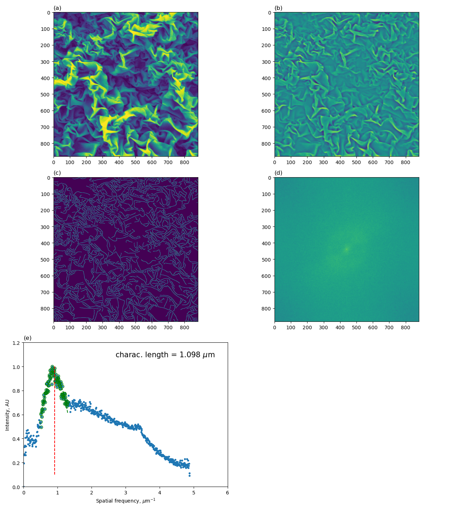

# morpholoPy
A suite of morphology analyses for the characterization of nanostructured surfaces.

<b>André Guerra</b> \
April, 2024 \
andre.guerra@mail.mcgill.ca  

---
<b>Description:</b> \
This repository contains Python implementations of image analysis algorithms for feature analysis of nanostructured material surfaces. Many of the scripts take an image file (e.g., .png, .tif) as input, conduct the periodic feature analyses and output figures summarizing the results. Many of the scripts currently require manual modification for defining your system. These are normally done in the "Manual input" section at the top of the script. The scripts will be updated in the future to be more robust and require less manual input at the code level.

---
## Core Contents
1. `tests/` $\rightarrow$ collection of test cases to validate and demonstrate usage.
2. `_wrinklelib.py` $\rightarrow$ contains functions to be used by `wrinkleAnalysis.py`
3. `wrinkleAnalysis.py` $\rightarrow$ main script executing the image analyses and surface feature examinations.

## References
1. [Stimpson et al., 2020](https://chemrxiv.org/engage/chemrxiv/article-details/60c74e50f96a009895287acf)
2. [De France et al., 2019](https://pubs.acs.org/doi/full/10.1021/acsami.8b16232)
3. [Wang-Servio-Rey, 2023](https://doi.org/10.3389/frsfm.2023.1123324)

---

## Tests

### Vertical stripes

This test reproduces the results from Stimpson et al., 2020 for the vertical stripes in Figure 1A first panel. 

Source: [Stimpson et al., 2020](https://chemrxiv.org/engage/chemrxiv/article-details/60c74e50f96a009895287acf) 
Figure 1 

#### Vertical stripes test results:

### Chevron

This test reproduces the results from Stimpson et al., 2020 for the chevron lines in Figure 1A second panel. 

Source: [Stimpson et al., 2020](https://chemrxiv.org/engage/chemrxiv/article-details/60c74e50f96a009895287acf) 
Figure 1 

##### Chevron test results:

### Vertical stripes tiled and fragmented tiles

This test reproduces the results from Stimpson et al., 2020 for the jigsaw and fragmented jigsaw lines in Figure 1A third and forth panels. 

Source: [Stimpson et al., 2020](https://chemrxiv.org/engage/chemrxiv/article-details/60c74e50f96a009895287acf) 
Figure 1 

The jigsaw and fragmented jigsaw images were made using Photopea at https://www.photopea.com/. The original vertical stripes image was used to create these transformed images. 

#### Vertical stripes tiled (tessellation) test results:

#### Fragmented tiles (tessellation fragmented) test results:

### kdf_biaxial_20um

This test uses a biaxial wrinkled surface with a scale bar of 20 microns (um). The scale bar is 170 pixels in length. 

Source: [De France et al., 2019](https://pubs.acs.org/doi/full/10.1021/acsami.8b16232) 
ACS Appl. Mater. Interfaces 2019, 11, 6, 6325–6335 
Figure 6F

#### Results summary figure

### kdf_uniaxial_20um

This test uses a uniaxial wrinkled surface with a scale bar of 20 microns (um). The scale bar is 170 pixels in length. 

Source: [De France et al., 2019](https://pubs.acs.org/doi/full/10.1021/acsami.8b16232) 
ACS Appl. Mater. Interfaces 2019, 11, 6, 6325–6335 
Figure 6J

#### Results summary figure

### xg-cnc_1-1

This test demonstrates the usage of the function `measureScaleBar()` with an SEM image that is not originally square and contains an info banner at the bottom with the length scale.

#### Original SEM image

#### Rsults summary figure

## Workflow and usage

### `wrinkleAnalysis.py`

The workflow of this script is as follows: 
1. Input parameters - to be manually changed to reflect the desired analysis, define the image file, and size parameters which depend on the scale of the image. The size parameters can be determined through trial and error by examining the curve fitting and wrinkle size estimate in the panel 6 of the summary figure produced.
2. Input image file (`img_file`)
3. Band-pass filtering of the image using Gaussian differences
4. Canny edge detection - `sigma` value is modified to achieve the desired granularity in edge detection
5. Square the image (if not already squared)
6. Determine image scale and pixel relationship - if the image contains an SEM banner with a size scale, the function `measure_scale_bar()` can be used to extract the pixel length of the scale bar. The representative physical length of the scale bar must be input manually (`bar_length`).
7. Center-shifted 2D FFT (`fft2_shiftd`) of the image to obtain the 2D power spectral density (PSD) (`psd2D`) of the image.
8. Radially averaged 2D PSD (`rasp`).
9. Frenquency conversion from pixel to spatial length.
10. High and low filters.
11. Curve fitting of the most prominent peak in the `rasp` to extract the feature size.
12. Visualization of the results output to `figures/`.

### Usage

To run the `wrinkleAnalysis.py` script:
1. Go to the desired test directory: `cd tests/kdf_biaxial_20um/`
2. The image to be analyzed should be found in the `images` directory.
3. Run the script: `python src/wrinkleAnalysis.py`

The output figures will be saved in the `figures/` directory.